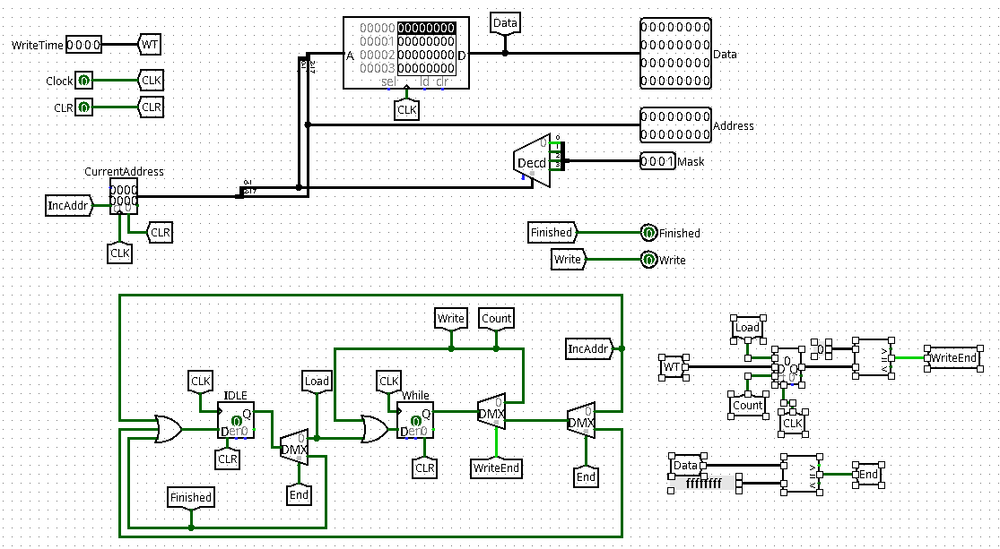

# Práctica de Arquitectura de Computadoras
## Automatización de Tests

#### Darío Fragas González, C213

# Introducción:

Durante el desarrollo del Proyecto final de Arquitectura de Computadoras, el cual consiste en diseñar en Logisim un procesador que implemente la arquitectura de juegos de instrucciones S-MIPS (Simplified-MIPS), tropezamos con el problema de testear el circuito. La opción disponible hasta el momento era cargar manualmente las instrucciones a ejecutar, separadas en 4 bancos. Este proceso puede resultar tedioso pues implica por cada fragamento de código que queramos probar compilar dicho código, abrir el Logisim, establecer los parámetros para ponerlo en modo imulación, por cada una de las 4 rams cargar los datos correspondientes. Lo cuál supone un cúmulo de tareas repetitivas que pudieran optimizarse de alguna forma.

En está práctica se brinda una posible implementación para la automatización de dicho proceso. Se naliza las ventajas y limitantes que tienen dicha implementación además se brinda un template modificado que los estudiantes deberán usar a la hora de implementar sus procesadores así como un script que permitirá la ejcución de multiples test con solo correr un comando en consola.

# Bases:

Logisim nos brinda un modo de ejecución por consola en la cual podemos verficar el comportamiento de nuestro circuito ([Command-line verification](http://cburch.com/logisim/docs/2.7/en/html/guide/verify/index.html)). El parámetro **-tty** ejecuta el circuito en la terminal, este parámetro toma además varios arguentos para determinar el modo en que se llevara la simulación. 

 Por ejemplo, *table* pasará a cada input todos los posibles valores que pueda tomar e imprime una tabla relacionando la entrada en cada input con los respectivos outputs obtenidos. Este método resulta cómodo para testear circuitos combinatorios. El argumento *speed* muestrá información relacionada al tiempo que duró la simulación así como la frecuencia media de los relojes. *halt* detiene la ejecución si existe algún output con la etiqueta **"halt"** y este output toma el valor 1 y *tty* imprime el output de cada componente tty dentro del circuito a la salida estándar. Puede consultar el comportamiento de otros parámetros en la [documentación oficial](http://cburch.com/logisim/docs/2.7/en/html/guide/verify/other.html).

 Otro paramétro importante para nuestro caso es el parámetro **-load**, el cual toma como argumento la dirección a un fichero que contiene la imagen o banco de datos a cargar en RAM. El comportamiento de Logisim será el siguiente: buscar recursivamente cada RAM dentro del circuito principal y cargar los datos del fichero imagen en está RAM. 

# Problemas del estado actual:

Como se encuentra implementado la RAM del proyecto resulta imposible el uso de los parámetro mencionados en la sección anterior para testear el circuito desde la terminal dado que existen 4 bancos como componentes RAMs. En lo adelante cuando se emplee el término RAM se referirá al circuito dado en la plantilla del proyecto representando la RAM, mientras que componente RAM o banco RAM se usará para el componente que implementa built-in Logisim representando una RAM.

Usar el parámetro **load** implicaría que el código a ejecutar a de estar en un único fichero de forma sequencial a difernecia de los 4 necesario para cada banco. Además de cargar todo el código con este comando implicaría que se tendrá el mismo código en cada banco lo que supone que cada instrucción será ejecutada 4 veces seguidas.

# Ideas para corregir el estado actual:

Si se implementa una unidad distribuidora que una vez cargadas las instrucciones a ejecutar (puestas en un único fichero), borrara de la RAM los datos escritos y repartiera las instrucciones entre los bancos antes de iniciar la ejecución, podríamos hacer uso de las opciones CLI que brinda Logisim. 

En principio está unidad podría tener una bandera de control que indique si desea usarse o no, permitiendo al usuario testear el circuito como hacíamos hasta ahora. Estaría compuesta por un banco RAM desde el cual se leerían las instrucciones y/o datos y se escribirían a la RAM, manteniendo el estado de RESET del resto del procesador hasta concluir dicha escritura y una vez terminada la escritura diera inicio normal al CPU. 

# RAM-Dispatcher. Detalles de la implementación:

A continuación se muestra cómo se implementó dicho componente.

Toma como entradas el tiempo de escritura en RAM, la entrada de reloj y una entrada clear para limpiar el estado de los registros y memoria usado. Como salidas tendrá la instrucción de 32 bits a escribir, una dirección de 16 bitas así como una máscara de 4 bits que indican la línea y el banco a escribir de la RAM respectivamente, una bandera (WRITE) que habilita la escritura en RAM y una bandera FINISHED que indica que se termino el proceso.

En el banco va a estar almacenado en un principio las instrucciones del programa que se desea ejecutar. El comportamiento es el siguiente:

1- Se activa un contador con el tiempo de escritura de la RAM y se activan las salidas de datos correspondiente a la dirección almacenada en el registro 'CurrentAddress' (inicialmente apuntado a la dirección 0x0)

2- Se espera en un ciclo While a que se escriba el dato en memoria

3- Se incrementa el valor del puntero de dirección (Registro CurrentAddress) hasta que la condición de parada se cumpla.

La condición de parada puede ser variable, en primera instancia podría consistir en mapear toda la memoria pero eso sería eficiente dado que raramento un código tenga $2^{18}$ instrucciones, una alternativa puede ser agregar un valor de datos que no corresponda a ninguna instrucción e indique el fin de la carga (y este dato no se copiaría a la RAM por supuesto). Se tomó este segundo acercamiento para esta implementación (tomando el valor 0xFFFFFFFF) con las respectivas modificiaciones al ensambaldor para que genere además de los 4 bancos habituales un banco con las instrucciones unificadas y con el metadato de parada al final.

# Modificaciones de la plantilla actual requeridas:

Se ha de modificar la plantilla actual en orden de conectar a la RAM el dispatcher en tiempo de carga y desconectarlo en tiempo de ejecución del CPU. Para ello se settean las entradas con varios multiplexer basado en si se finilazó la carga de la memoria con el dispatcher o está carga no fue activada. 

En el componente S-MIPS Board distribuido en el archivo s-mips-template.circ junto a este informe se reflejan las modificaciones realizadas.

# Limitaciones de la implementación:

Si se intentan cargar N instrucciones y existe una componente RAM incapaz de almacenar estas N instrucciones se lanzará una excepción al tratar de ejecutar Logisim y la simulación no se llevará a cabo, luego es de vital importancia que si en la implementación del procesador el estudiante utiliza componentes RAM estas sean lo suficientemente grandes como para almacenar la cantidad de instrucciones máximas que se deseen testear. 

Como alternativas estaría prohibir a los estudiantes usar componentes RAMs o en caso de hacerlo que estas puedan almacenar un número N considerablemente grande de instrucciones (Que no debe ser tan grande realmente). Por ejemplo entre los test utilizados el más grande es liset que no tiene más de 200 instrucciones así que con memorias de 8 bits de dirección podrían probarse todos los test que se tienen hasta ahora.

Otra limitante importante es que se requiere que la salida halt se encienda al finalizar el test por tanto los test infinito como los de entradas del teclado deberían probarse desde dentro de la aplicación GUI. 

# Automatización de los tests:

Se proveé además un script en Python que dado un directorio escanea todos los ficheros .asm recursivamente dentro de dicho directorio y subdirectorios ensamblando el código de cada uno y generando los test correspondientes. Se espera encontrar dentro del fichero .asm una línea con un comentario de la siguiente forma:
**#prints** [:space:] *salida esperada*

Así cada test se ejecuta imprimiendo **OK** o **FAIL** en dependencia de si se obtuvo el resultado esperado o no. El script toma además varios niveles de verbosidad en el que brinda información más detallada de la ejecución.
